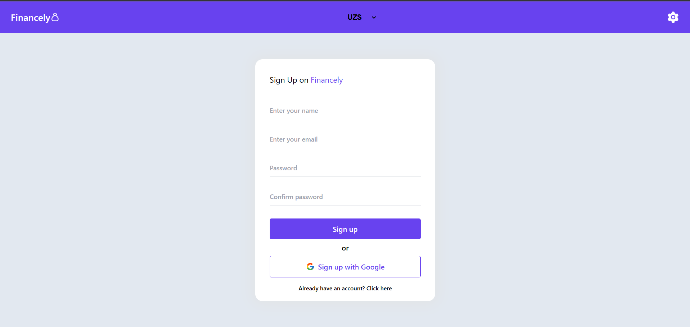
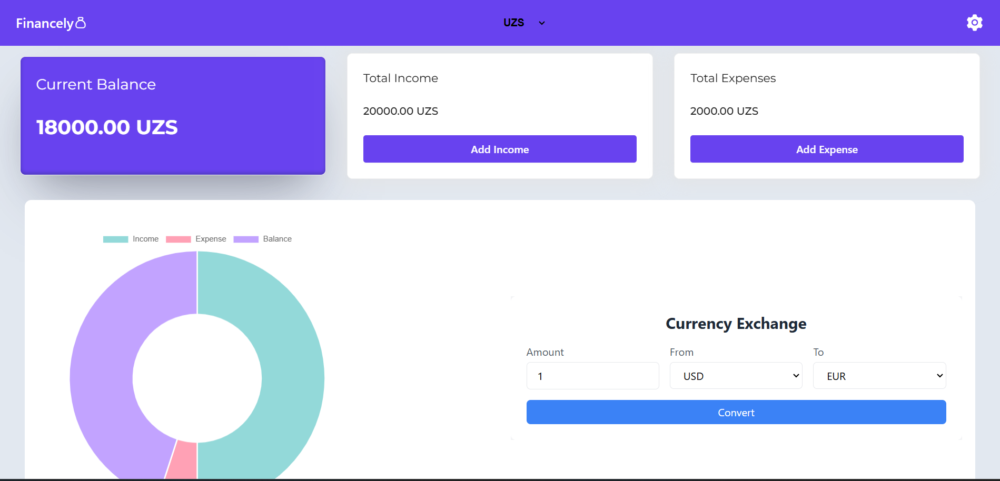
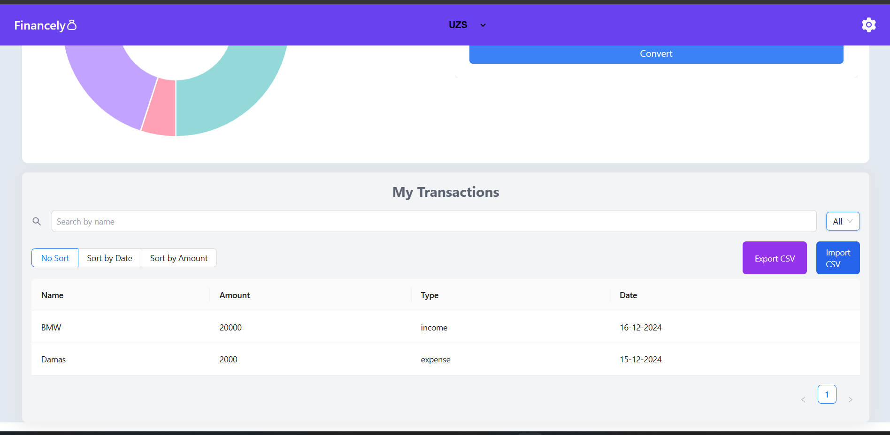

# Personal Finance Tracker

A modern and user-friendly web application built with React that empowers users to manage and monitor their personal finances efficiently.





---

## 1. Features

### Transaction Management
- Add, edit, and delete financial transactions.
- Categorize transactions as **Income** or **Expense**.
- Track transaction details, including:
  - Name
  - Amount
  - Type
  - Date

### Filtering & Sorting
- **Search transactions** by name.
- **Filter** transactions by type (Income/Expense).
- **Sort transactions** by:
  - Date
  - Amount
  - No sorting (default).

### Data Import/Export
- Export transactions to a CSV file for backup.
- Import transactions from CSV files for bulk updates.
- **CSV Format** includes:
  - Name
  - Type
  - Tag
  - Date
  - Amount

### User Interface
- Clean and fully responsive design.
- Interactive and dynamic table for transaction management.
- Modal-based transaction editing.
- Real-time search and filter functionality.

### Security
- Firebase Authentication integration for secure login/logout.
- Secure data storage with Firebase Firestore.
- User-specific transaction isolation.

---

## 2. Technical Stack

- **Frontend Framework**: React.js  
- **UI Components**: Ant Design (antd)  
- **Database**: Firebase Firestore  
- **Authentication**: Firebase Auth  
- **State Management**: React Hooks  
- **Styling**: CSS/Tailwind CSS  
- **Icons**: React Icons  
- **CSV Handling**: PapaParse  
- **Notifications**: React-Toastify  

---

## 3. Installation

1. Clone the repository:
   ```bash
   git clone https://github.com/your-username/personal-finance-tracker.git
   cd personal-finance-tracker
